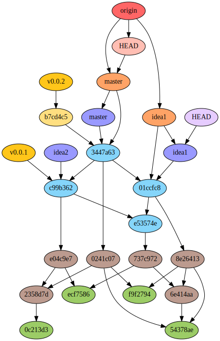

# Git-graph

#### Learn Git fast and well - *by revealing the inner graph of your Git repositories*
___



> [Git is a fast, scalable, distributed revision control system with an unusually rich command set
that provides both high-level operations and full access to internals.](https://git-scm.com/docs/git)

The downside of this rich command set is the apprehension it brings to beginners.

A good way to overcome this difficulty is to experiment the effects of each new Git command on a dedicated test repository.
This is made possible thanks to Git lightness and the fact it is immediately up and running in any new repository with `git init`.

Git-graph is a Git plugin, written in Python, that displays your Git repositories inner content as a Directed Acyclic Graph (DAG).
This structured visual representation of Git internal data demystifies the impact of each Git command and considerably improves the learning curve.

## Install

#### From Conda
Conda is the simplest option to install Git-graph:
1. You just have to run:
    ```
    conda install git-graph
    ```

#### From PyPI
To install Git-graph from PyPI:
1. You first need to install [Graphviz](https://www.graphviz.org/download/) and check that the dot binary is correctly set in you system's path.  
2. Then run: 
    ```
    pip install git-graph
    ```

#### From GitHub
To install Git-graph from GitHub:
1. You first need to install [Graphviz](https://www.graphviz.org/download/) and check that the dot binary is correctly set in you system's path.  
2. Then run:
    ```
    git clone https://github.com/hoduche/git-graph
    ```
3. Finally you will have to run the setup.py file:
    ```
    python setup.py install
    ```

## Run

#### As a Git plugin
Git-graph should preferably be run as a Git plugin with the command `git graph`

- At the root of a Git repository:
```
git graph
```

- Anywhere, using the `-p` or `--path` option.  
Here is an example where the nodes in the graph are restricted to blobs, trees and commits and the ouput format is set to svg:
```
git graph -p examples/demo -n btc -f svg
```

Running `git graph` on a Git repository will:
1. scan you .git folder
2. build and save a graph representation of the .git folder internals as text (.dot) and image (pdf by default) in a .gitGraph folder
3. popup a window that displays the image of your graph

A color code helps in distinguishing in the graph the different kinds of object Git is using in its implementation:

| Object kind    | Letter | Representation                                     |
| -------------- | ------ | -------------------------------------------------- |
| blob           | b      |                    |
| tree           | t      |                    |
| commit         | c      |                |
| local branche  | l      |    |
| local head     | h      |        |
| remote branche | r      |  |
| remote head    | d      |      |
| remote server  | s      |  |
| annotated tag  | a      |  |
| tag            | g      |                      |
| upstream link  | u      | edge                                               |

By default all nodes are displayed in the output graph when running `git graph`
To focus the display on what you are interested in monitoring,
it is possible to select only certain types of objects in the graph with the -n option
for instance to only display blob, trees and commits:
git graph -n btc

The default output format is pdf.
Other output graphics format (either vector or raster) can be set with the -f (or --format) option
for instance:
git graph -f svg
the full list of possible formats can be found on the Graphviz documentation website:
https://graphviz.gitlab.io/_pages/doc/info/output.html

By default Git-graph graph considers it is launched from a Git repository (ie where a .git folder can be found).
It is possible to indicate the path of another Git repository with the -p (or --path) option
git graph -p examples/demo

Finally it is possible to prevent the graph image popup with the -c (or --conceal) option
git graph -c

#### As a Python program
```
python git_graph/dot_graph.py -p examples/demo -n btc -f svg
```
or
```
./git_graph/dot_graph.py -p examples/demo -n btc -f svg
```
    
#### As a Python module

```python
import git_graph.dot_graph as dg
dg.DotGraph('..').persist()
dg.DotGraph('../examples/demo', nodes='btc').persist(form='svg', conceal=True)
```
